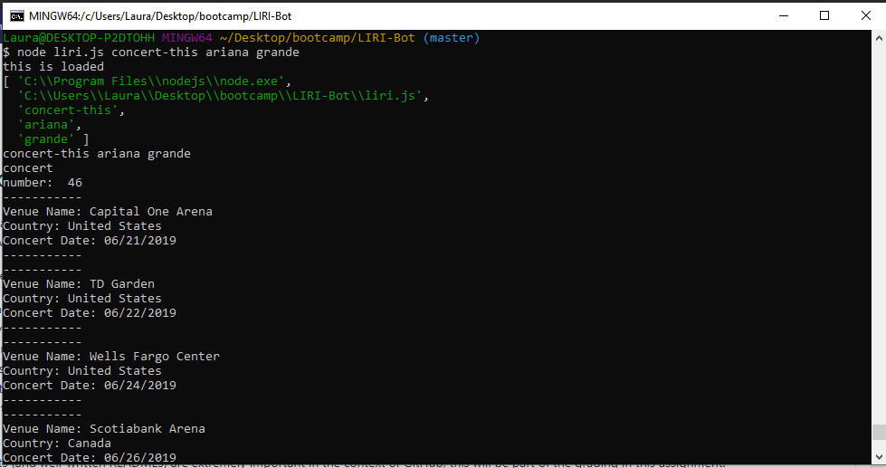
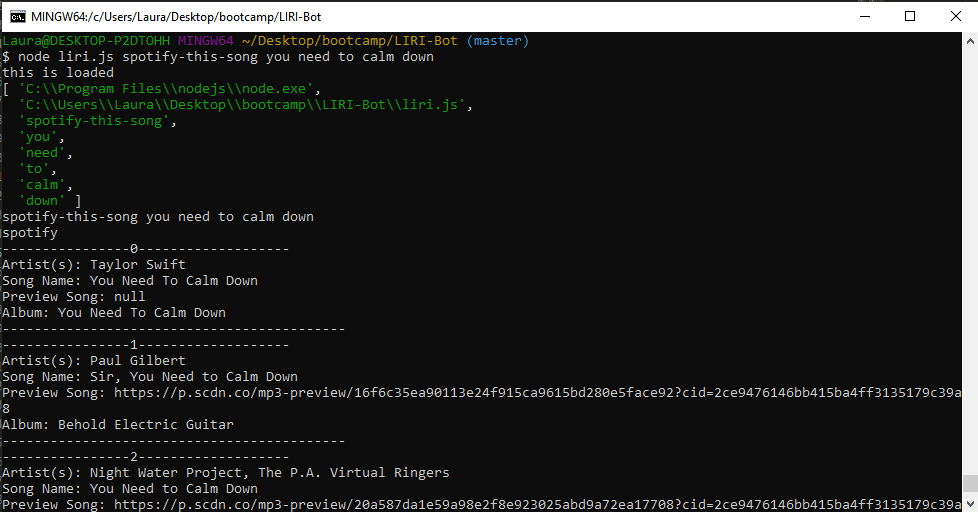
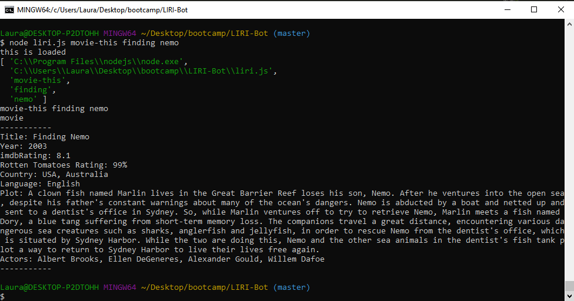

How To Use LIRI-Bot

1. Open your terminal.

2. Navigate to the folder that contains the liri.js file.

3. The output will depend on the command you run.

There are four commands: 

1. node liri.js concert-this

2. node liri.js spotify-this-song

3. node liri.js movie-this

4. node liri.js do-what-it-says

